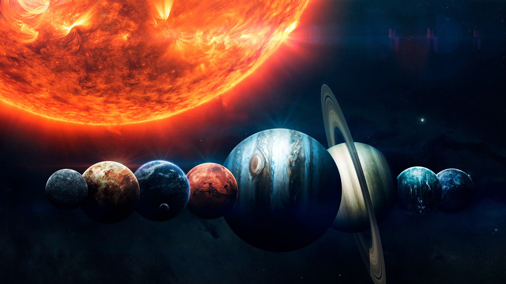
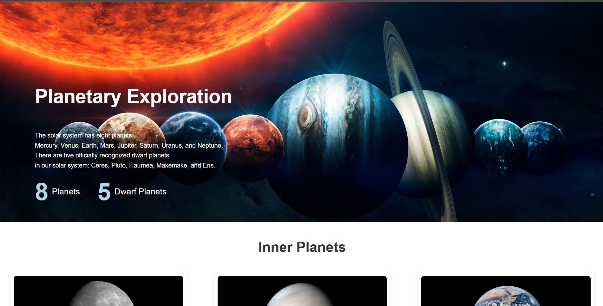

# 🌌 Planetary Exploration

[](https://html5.org/)
[](https://css-tricks.com/)
[](https://developer.mozilla.org/en-US/docs/Learn/CSS/CSS_layout/Responsive_Design)

## Overview

**Planetary Exploration** is an educational, responsive webpage showcasing the 8 planets and 5 dwarf planets of our solar system. Built with pure HTML and CSS, it features high-quality NASA images, engaging descriptions, and direct links to official NASA facts pages.



Explore the wonders of space from your browser!

## Features

- **Interactive Planet Cards**: Hover effects and smooth scaling for each planet/dwarf planet.
- **Organized Sections**: Inner Planets, Outer Planets, and Dwarf Planets.
- **NASA-Sourced Content**: Authentic images and links to [NASA Science](https://science.nasa.gov).
- **Fully Responsive**: Optimized for desktop, tablet, and mobile (flexbox layout + media queries).
- **Zero Dependencies**: No JavaScript or build tools – just open `project.html`.
- **Fast & Lightweight**: Single HTML file with embedded styles.

## Screenshots

### Desktop View


## Live Demo

Open [project.html](project.html) in any modern browser.

To host on GitHub Pages:
1. Push to GitHub repo.
2. Enable Pages in Settings > Pages > Deploy from branch `main` > `/ (root)`.

## Quick Start

1. Clone/download the repo.
2. Double-click `project.html` or drag to browser.
3. Explore the planets!

```
# No setup needed!
open project.html  # macOS
start project.html  # Windows
xdg-open project.html  # Linux
```

## Credits

- **Images**: NASA/JPL/Caltech (public domain).
- **Icons**: [Font Awesome](https://fontawesome.com) (CDN).
- **Inspiration**: Planetary science facts from [NASA](https://science.nasa.gov).

## License

MIT License – feel free to use, modify, and distribute.

---

⭐ Star the repo if you enjoy space exploration! 🚀
